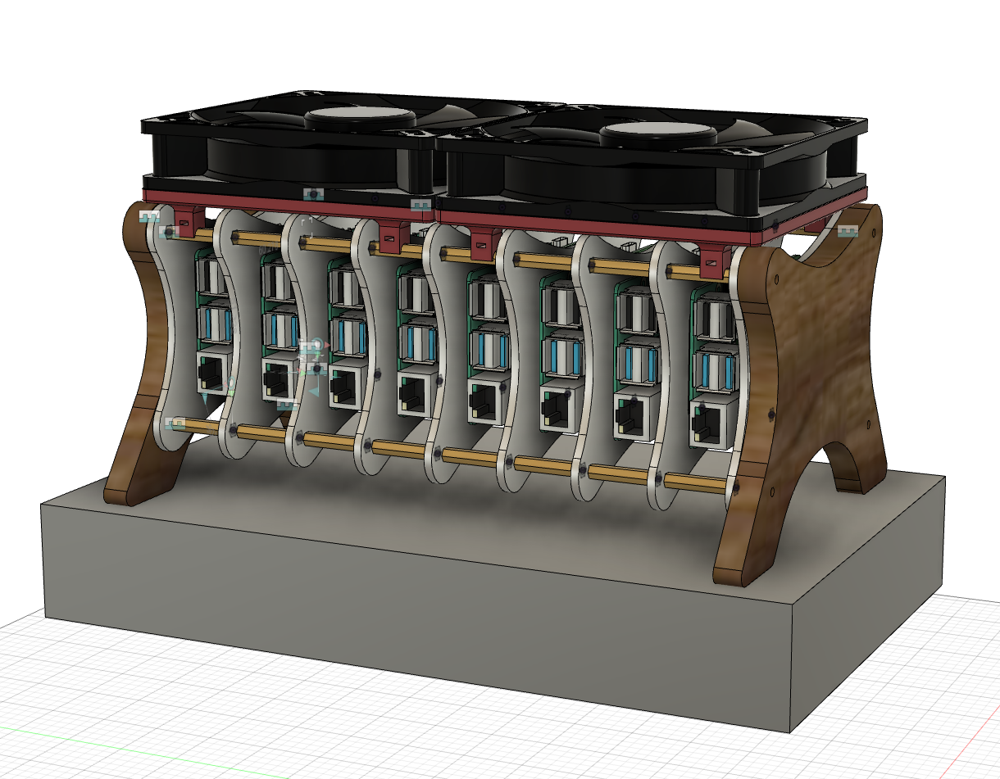
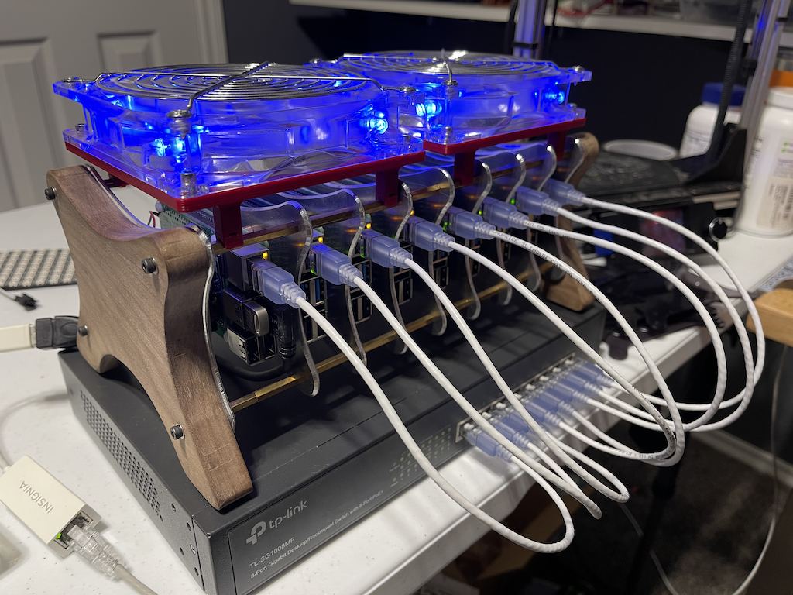

# Building a Kubernetes Cluster Using the Raspberry Pi

- [Building a Kubernetes Cluster Using the Raspberry Pi](#building-a-kubernetes-cluster-using-the-raspberry-pi)
  - [Introduction](#introduction)
  - [Software](#software)
    - [Burn all your SD Cards](#burn-all-your-sd-cards)
    - [Master Setup](#master-setup)
    - [Worker Setup](#worker-setup)
    - [SSH Key Configuration](#ssh-key-configuration)
  - [microk8s Setup](#microk8s-setup)
    - [Monitoring](#monitoring)
    - [Ingress](#ingress)
  - [WIP BELOW THIS POINT - Check back soon!](#wip-below-this-point---check-back-soon)
## Introduction


This article serves mainly as a brain dump of my experience building up a Kubernetes cluster using the Raspberry Pi 4 SBC. I did this purely as an educational exercise and came into it with absolutely no knowledge of Kubernetes at all. So, if you're as ignorant as I was, this may also be a useful guide for you to follow to build your own. 



I made this whole thing into quite a bit of a project. I not only set up a network of Raspberry Pis, I also designed and built a custom "rack" for the whole thing. Details about all of this along with manifests, helpful scripts, CAD models, and a chronicle of the headaches I ran into are all covered in this article.

## Software
This section covers the software setup of the cluster in exhaustive detail. I put this section first because you likely don't care about how I physically assembled my cluster, but if you do, go ahead and skip ahead to the Hardware section and then come back here. 

First, let's talk about what _kind_ of cluster I chose to set up. There are a number of ways you can do this, but for me doing this purely as a learning process and having no practical requirements in mind, I chose to impose the following goals on my project. 

1. The cluster should live on its own subnet.

1. I should be able to administrate the entire mess _headlessly_.

1. The cluster should _still_ be able to reach the internet.

So let's talk about how I ultimately achieved each of these goals. 

_**The cluster should live on its own subnet**_

I already know that ultimately my Kubernetes cluster will have a "master node". So, I decided to give this node an additional responsibility: router. The master node will not only be the singular node I interact with when administrating the cluster, but it will also act as a DHCP server supplying IP addresses for each of the worker nodes. 

_**I should be able to administrate the entire mess headlessly.**_

I know I could simply plug into a keyboard, mouse, and a monitor up to the master node and control everything that way. But I really want to be able to screw around with it while watching TV and sitting on the sofa. So, I will include the "master node" in my home network. This will be the _only_ node which is exposed to my network. I don't want to have _n_ nodes polluting my already busy home network. 

_**The cluster should still be able to reach the internet**_

Even though I want the cluster siloed, I still want it to be able to reach the internet. I could do without this, but installing software, pulling docker images, etc. would be much more tedious. So each node will still be able to reach the internet by communicating through the "master node" and ultimately through my regular home network. 

Finally, I'll note that none of this article will use Ansible (yet). I also knew nothing about Ansible upon taking on this project, but skipping over a lot of this manual setup work using Ansible would negate the educational offering that is the entire purpose of this exercise. I will likely revisit this in the future and publish a new article using Ansible once I have had the time to learn it myself.

So let's get after it. I am going to walk through everything in as much detail as I can. We'll start by setting up the master node, followed by the worker nodes. I will reference files in this repo when we encounter something I struggled with enough to warrant not wanting to do it manually a second time. However, I will try to still explain every roadblock I ran into along the way and how I overcame it. 

### Burn all your SD Cards
Since this step applies both to the "master node" as well as the worker nodes, I will cover it first. I found it easiest to get all my SD cards set up and installed before moving on to setting up each individual node. 

1. Burn _Ubuntu Server 20.04 (64 bit)_ to each of your SD cards.
- You can do this using the Raspberry Pi Imager found [here](https://www.raspberrypi.org/%20downloads/)

 - Once installed, select **Choose OS>Other general purpose OS>Ubuntu>Ubuntu Server 20.04 LTS (RPi 2/3/4/400)**

 - Select **Choose Storage** and select your SD card. 
 - Once you're ready, hit **Write** and give it your password in order to start writing the image to the SD card. 
 - At this point, you can do yourself a favor and `/boot/cmdline.txt` now. You _can_ do this later, but it's easier to go ahead and do it now. 
   - Mount the SD card you just imaged. You may need to remove and reinsert the card in order for it to be seen by your computer again.
   - Locate and edit the `cmdline.txt` file located in the `boot` partition. 
   - Prepend the following text to the existing contents of the file.
     - `cgroup_enable=memory cgroup_memory=1` 
- Repeat the whole process for each SD card/node you'll have in your cluster.

### Master Setup
At this point, I recommend only booting up a single node until you get it set up as the master. It's just easier to focus on one thing at a time. 

1. Boot a single node. We'll consider this the "master" node. 
1. Connect the node to your regular home network using an ethernet cable. We'll change this up later. 
1. Locate the IP address of the node. Doing this is outside the scope of this article. I used my home network's router to look it up. Depending on your configuration, you may also have some luck simply using the default hostname "ubuntu.local" in lieu of the IP address for the subsequent steps. YMMV.
1. SSH into the node. 
   ```console
   scott@macbook ~ % ssh ubuntu@<node-ip-address>
   ```
   Enter the default password "ubuntu". You will be prompted to immediately change the password. Go ahead and set it to something you'll remember. We'll set it up so that you don't need this password as much later. 
1. Change the hostname to something meaningful. I chose to call my master node "bramble-master". Of course you can choose whatever you like.
   ```console
   ubuntu@ubuntu:~$ sudo hostnamectl set-hostname bramble-master
   ```
1. (Optional) If you didn't do it earlier, you'll need to enable memory control groups. If you've already done this, you can skip to the next step.
   
   ```console
   ubuntu@bramble-master:~$ sudo vim /boot/firmware/cmdline.txt
   ```

   Prepend the following text to the contents of the file. 

   ```bash
   cgroup_enable=memory cgroup_memory=1
   ```

1. Set up either a secondary, USB ethernet device, or WiFi on your home network. 

   The device names for these devices are _probably_ what is shown below. However, the best thing to do is to check what they are on your system using the following command: 

   ```console
   ubuntu@bramble-master:~$ ls /sys/class/net
   eth0  eth1  lo  wlan0
   ```

   Here, you can see I have four interfaces. `eth0` is the on-board ethernet, `eth1` is my USB ethernet adapter, `lo` is the localhost, loopback interface, and `wlan0` is the on-board wifi adapter.

   Edit `/etc/netplan/50-cloud-init.yaml`.

   ```console
   ubuntu@bramble-master:~$ sudo vim /etc/netplan/50-cloud-init.yaml
   ```

   Add the text below that corresponds to how you would prefer to interact with your cluster: USB ethernet or WiFi.


   Option 1: `eth1` - USB Ethernet Adapter

   ```bash
   network:
      ethernets:
         eth0:
               dhcp4: true
               optional: true
         eth1:
               dhcp4: true
               optional: true
      version: 2
   ```

   Option 2: `wlan0` - On-board Wifi
   ```bash
   network:
      ethernets:
         eth0:
               dhcp4: true
               optional: true
      version: 2
      wifis:
         wlan0:
               dhcp4: true
               optional: true
               access-points:
                  "my_super_cool_network_name":
                     password: "my_5up3r_c00l_p455w0rd"
   ```
1. Install and configure `dhcpcd5` in order to dish out IP addresses to all the worker nodes you'll add later.

   ```console
   ubuntu@bramble-master:~$ sudo apt install dhcpcd5 -y
   ```

   Modify `/etc/dhcpcd.conf` to set a static IP, and to specify the DNS servers you'd like to use. Add the following to the end of the file.

   ```bash
   denyinterfaces eth1 wlan0

   interface eth0
   static ip_address=10.0.0.1/8
   static domain_name_servers=8.8.8.8,8.8.4.4
   nolink
   ```

   **Warning**: In the snippet above, the `denyinterfaces` bit I found to be important to keep `dhcpcd` from trying to assign those interfaces IP addresses on its own. I let my home network's router dish out those IPs and if I didn't supply this line, I ran into a lot of issues with Kubernetes later on. 

1. Now we can install `dnsmasq`. This will let all the worker nodes use the master node as a DNS server. 

   ```console
   ubuntu@bramble-master:~$ sudo apt install dnsmasq
   ...
   ...
   ubuntu@bramble-master:~$ sudo vim /etc/dnsmasq.conf
   ```

   I've included my `dnsmasq.conf` mainly for my own reference. But you can certainly use it as a reference as well. 

   ```bash
   interface=eth0
   listen-address=11.0.0.1
   dhcp-range=11.0.0.32,11.0.0.128,12h
   bind-interfaces
   expand-hosts

   # I got the MAC address of each Pi and gave it a static IP here.
   # This means I don't have to do this manually on each node.
   dhcp-host=e4:5f:01:0c:c9:9d,11.0.0.50
   dhcp-host=e4:5f:01:0c:c9:c6,11.0.0.51
   dhcp-host=e4:5f:01:0c:ca:50,11.0.0.52
   dhcp-host=e4:5f:01:0c:c6:cc,11.0.0.53
   dhcp-host=dc:a6:32:12:2d:eb,11.0.0.54
   dhcp-host=e4:5f:01:02:1e:a4,11.0.0.55
   dhcp-host=e4:5f:01:02:1d:a5,11.0.0.56

   # These are Google's DNS servers. Use them if you dare. *tinfoil hat*
   server=8.8.8.8
   server=8.8.4.4
   ```

1. Now we want to allow traffic _from_ our nodes _through_ the mater _to_ the internets. To do that, we'll enable forwarding in `/etc/sysctl.conf`.

   ```console
   ubuntu@bramble-master:~$ sudo vim /etc/sysctl.conf
   ```
   Locate the following line and uncommend it (remove the "#" at the beginning of the line.)

   ```bash
   #net.ipv4.ip_forward=1
   ```
   Next, we need to tell iptables to do some magic that I don't understand but which [this person](https://downey.io/blog/create-raspberry-pi-3-router-dhcp-server/) seemed to.
   Be sure to replace `wlan0` below with whichever interface you chose to use earlier in step 7.

   ```console
   ubuntu@bramble-master:~$ sudo iptables -t nat -A POSTROUTING -o wlan0 -j MASQUERADE
   ubuntu@bramble-master:~$ sudo iptables -A FORWARD -i wlan0 -o eth0 -m state --state RELATED,ESTABLISHED -j ACCEPT
   ubuntu@bramble-master:~$ sudo iptables -A FORWARD -i eth0 -o wlan0 -j ACCEPT
   ```

   Now, because reasons, these settings wont survive a restart. I found the easiest thing to do is to install `iptables-persistent` and let it handle it.

   ```console
   ubuntu@bramble-master:~$ sudo apt install iptables-persistent
   ```
1. This step is entirely _optional_. I, however, chose to overclock every node in my cluster. I found a 2Ghz overclock on the Raspberry Pi 4 to be perfectly stable, and my cooling solution (See Hardware) is more than adequate to keep them cool. Do this at your own risk, however.

   ```console
   ubuntu@bramble-master:~$ sudo vim /boot/firmware/usercfg.txt
   ```

   Add the following text to the end of this file. 

   ```bash
   over_voltage=6
   arm_freq=2000
   ```

   It's just that easy!

1. Now you can restart the node. Your master node is ready to go!


### Worker Setup

Fortunately, the setup required for the workers is much less involved. 
1. Start by setting the hostname. I chose to follow a "bramble-worker-_n_" naming scheme, but this is up to you.

   ```console
   ubuntu@ubuntu:~$ sudo hostnamectl set-hostname bramble-worker-1
   ```

1. Next, just like we did for the master, we need to enable memory control groups. 

   ```console
   ubuntu@bramble-worker-1:~$  sudo vim /boot/firmware/cmdline.txt
   ```

   and prepend this text to the existing file context:

   ```bash
   cgroup_enable=memory cgroup_memory=1
   ```
1. This step is entirely _optional_. I, however, chose to overclock every node in my cluster. I found a 2Ghz overclock on the Raspberry Pi 4 to be perfectly stable, and my cooling solution (See Hardware) is more than adequate to keep them cool. Do this at your own risk, however.

   ```console
   ubuntu@bramble-worker-1:~$ sudo vim /boot/firmware/usercfg.txt
   ```

   Add the following text to the end of this file. 

   ```bash
   over_voltage=6
   arm_freq=2000
   ```

   It's just that easy!

### SSH Key Configuration
By this point, you should have the nodes themselves configured and communicating with one another through their own isolated, dedicated subnet. And you should be able to access any of the nodes either by SSHing into your master node and then SSHing to the worker node. Or, alternatively, you can simply use the `-J` option for SSH to use your master node as a "jump box". 

e.g.
```console
scott@macbook ~ % ssh -J ubuntu@bramble-master ubuntu@bramble-worker-1
```

However, every time you do this, you'll need to provide the password for the done you're logging into. Since you'll be doing this a lot, we can make that easier by sharing SSH keys amongst the nodes. If you share _Node A's_ key with _Node B_, then _Node A_ will be able to SSH into _Node B_ without having to manually enter the password. You _can_ do this for every possible pair of host/client in the network, but I most just care about 

1. Dev Computer -> Master
1. Master -> Worker

Let's set up our cluster so we don't need to bother with passwords all the time.

1. First, create an SSH key from your Dev Computer. For me, this is my MacBook Pro.

   ```console
   scott@macbook ~ % ssh-keygen -t rsa
   Generating public/private rsa key pair.
   Enter file in which to save the key (/Users/scott/.ssh/id_rsa): /Users/scott/
   Enter passphrase (empty for no passphrase): 
   Enter same passphrase again: 
   Your identification has been saved in /Users/scott/temp/id_rsa.
   Your public key has been saved in /Users/scott/temp/id_rsa.pub.
   The key fingerprint is:
   SHA256:abunchofrandomlookingcharacters scott@macbook
   The key's randomart image is:
   +---[RSA 3072]----+
   ...
   +----[SHA256]-----+
   scott@macbook ~ % 
   ```

1. Now you can copy this key to any machine you wish to have passwordless access to.

   ```console
   scott@macbook ~ % ssh-copy-id ubuntu@bramble-master
   ```

   This will ask for your password to the master node, but once you complete this step, you will no longer need a password when SSHing into the master from you Dev Machine.

1. Test it out. SSH into the master node. No password needed!

   ```console
   scott@macbook ~ % ssh ubuntu@bramble-master
   ```
1. Now, from the master node, you need to repeat step 1. Then, repeat step 2 for each worker node in your cluster. 


## microk8s Setup
Finally, the infrastructure for our cluster is complete. Now it's time for the fun part: kubernetes. 

I chose to use `microk8s` as it seemed to have a good reputation, active development, and low resource usage. That last item is particularly important when running on a lower power SBC like the Raspberr Pi. 

1. As we're on Ubuntu, use `snap` to install `microk8s.
   ```console
   ubuntu@bramble-master:~$ sudo snap install microk8s --classic
   ```

   Installation on my Raspberry Pi 4s takes a couple minutes for each node. Repeat this step for _every_ node in your cluster; Master and worker.

2. To make our lives easier and to cutdown on repetative typing, add your `ubuntu` user to the `microk8s` group so we don't need to use `sudo` to run `kubectl`. 

   ```console
   ubuntu@bramble-master:~$ sudo usermod -a -G microk8s ubuntu
   ubuntu@bramble-master:~$ sudo chown -f -R ubuntu ~/.kube
   ```
   This only really needs to be done on the _master_ node, since it's the only one you'll usually be interacting with directly. It doesn't hurt, though, if you want to do it on the workers as well. 

3. Now we can add all the worker nodes. This is done by running a command on the master node which generates a command for you to run on the node you want to add. 

   ```console
   ubuntu@bramble-master:~$ microk8s add-node
   From the node you wish to join to this cluster, run the following:

   microk8s join 192.168.0.140:25000/12cdebf1459ae341848e5fbd97baa7e2

   If the node you are adding is not reachable through the default interface you can use one of the following:

   microk8s join 11.0.0.1:25000/12cdebf1459ae341848e5fbd97baa7e2
   ```

   You may see some more options than this. It creates one for every IP address the machine has. In this case, I chose the first one. Copy it, and head over to one of the nodes you want to add.

   ```console
   ubuntu@bramble-worker-1:~$ microk8s join 192.168.0.140:25000/12cdebf1459ae341848e5fbd97baa7e2
   ```

   Note that if you did not complete step 2 for each of your workers, you will need to prepend this command with `sudo` in order for it to work. 

4. Repeat these steps for every node you wish to add. 

### Monitoring
Kubernetes is hopefully now up and running. Among the first things I did once I got to this point was to set up a monitoring stack. Kubernetes can host the containers that will actually allow you to monitor both Kubernetes as well as the nodes on which it runs. Kubernetes monitoring Kubernetes!

The most prolific stack used for this purpose, and indeed the one I am familiar with through my day job, is [Prometheus](https://prometheus.io) + [Grafana](https://grafana.com).

- Prometheus: The thing what exports the stuff.
- Grafana: The thing what makes purdy graphs and widgets of the stuff.

Microk8s is great here because you can install and configure *both* by simply enabling it as follows.

```console
ubuntu@bramble-master:~$ microk8s enable prometheus
```

Although you only "enable" prometheus, it also sets up Grafana and even preconfigures Prometheus as a datasource in Grafana. You're ready to go!

For me, though, there were two things I wanted to get done that this command didn't do for me. 

1. **Ingress**. I want to be able to access Grafana from any browser on my home network.
2. **Persistence**. Both Grafana and Prometheus come preconfigured with `emptyDir: {}`, volatile storage. This means if the pod for either application is ever restarted, moved from one node to another, or for any reason crashes, then all your configured dashboards and all your collected metrics will be erased. 

There are some projects that compile a lot of great yaml manifests for setting up some really intricate monitoring dashboards with minimal effort (e.g. [cluster-monitoring](https://github.com/carlosedp/cluster-monitoring)). While, I did eventually end up using these projecs, I wanted to learn how to do the two things I mentioned above on my own first. I've included the manifests I eventually came up with in this repo, but I'll break them down here as we come to them. 

### Ingress
Let's start by enabling an nginx ingress controller. Microk8s, again, makes this really easy.

```console
ubuntu@bramble-master:~$ microk8s enable ingress
```
This step enables a DaemonSet which runs a pod on each of your nodes running nginx as a proxy to whatever service you configure your ingress for. Let's take a look at the ingress I created for grafana.

WIP BELOW THIS POINT - Check back soon!
---

1. Add an ingress and persistent storage for Grafana with. `kubectl apply -f grafana.yaml`
2. Patch grafana with `kubectl patch deployment grafana -n monitoring --patch "$(cat grafana_patch.yaml)"`