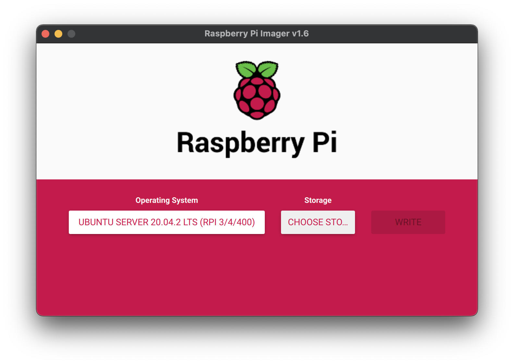
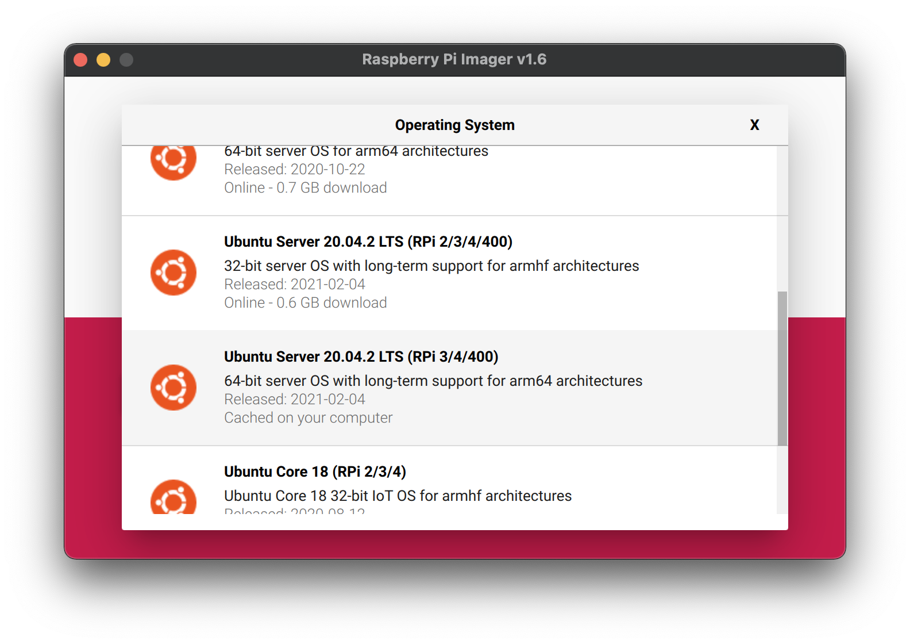

# Building a Kubernetes Cluster Using the Raspberry Pi
## Introduction
This article serves mainly as a brain dump of my experience building up a Kubernetes cluster using the Raspberry Pi 4 SBC. I did this purely as an educational exercise and came into it with absolutely no knowledge of Kubernetes at all. So, if you're as ignorant as I was, this may also be a useful guide for you to follow to build your own. 

I made this whole thing into quite a bit of a project. I not only set up a network of Raspberry Pis, I also designed and built a custom "rack" for the whole thing. Details about all of this along with manifests, helpful scripts, CAD models, and a chronicle of the headaches I ran into are all covered in this article.

## Software
This section covers the software setup of the cluster in exhaustive detail. I put this section first because you likely don't care about how I physically assembled my cluster, but if you do, go ahead and skip ahead to the Hardware section and then come back here. 

First, let's talk about what _kind_ of cluster I chose to set up. There are a number of ways you can do this, but for me doing this purely as a learning process and having no practical requirements in mind, I chose to impose the following goals on my project. 

1. The cluster should live on its own subnet.

1. I should be able to administrate the entire mess _headlessly_.

1. The cluster should _still_ be able to reach the internet.

So let's talk about how I ultimately achieved each of these goals. 

_**The cluster should live on its own subnet**_

I already know that ultimately my Kubernetes cluster will have a "master node". So, I decided to give this node an additional responsibility: router. The master node will not only be the singular node I interact with when administrating the cluster, but it will also act as a DHCP server supplying IP addresses for each of the worker nodes. 

_**I should be able to administrate the entire mess headlessly.**_

I know I could simply plug into a keyboard, mouse, and a monitor up to the master node and control everything that way. But I really want to be able to screw around with it while watching TV and sitting on the sofa. So, I will include the "master node" in my home network. This will be the _only_ node which is exposed to my network. I don't want to have _n_ nodes polluting my already busy home network. 

_**The cluster should still be able to reach the internet**_

Even though I want the cluster siloed, I still want it to be able to reach the internet. I could do without this, but installing software, pulling docker images, etc. would be much more tedious. So each node will still be able to reach the internet by communicating through the "master node" and ultimately through my regular home network. 

Finally, I'll note that none of this article will use Ansible (yet). I also knew nothing about Ansible upon taking on this project, but skipping over a lot of this manual setup work using Ansible would negate the educational offering that is the entire purpose of this exercise. I will likely revisit this in the future and publish a new article using Ansible once I have had the time to learn it myself.

So let's get after it. I am going to walk through everything in as much detail as I can. We'll start by setting up the master node, followed by the worker nodes. I will reference files in this repo when we encounter something I struggled with enough to warrant not wanting to do it manually a second time. However, I will try to still explain every roadblock I ran into along the way and how I overcame it. 

### Burn all your SD Cards
Since this step applies both to the "master node" as well as the worker nodes, I will cover it first. I found it easiest to get all my SD cards set up and installed before moving on to setting up each individual node. 

1. Burn _Ubuntu Server 20.04 (64 bit)_ to each of your SD cards.
- You can do this using the Raspberry Pi Imager found [here](https://www.raspberrypi.org/%20downloads/)

 - Once installed, select **Choose OS>Other general purpose OS>Ubuntu>Ubuntu Server 20.04 LTS (RPi 2/3/4/400)**

 - Select **Choose Storage** and select your SD card. 
 - Once you're ready, hit **Write** and give it your password in order to start writing the image to the SD card. 
 - At this point, you can do yourself a favor and `/boot/cmdline.txt` now. You _can_ do this later, but it's easier to go ahead and do it now. 
   - Mount the SD card you just imaged. You may need to remove and reinsert the card in order for it to be seen by your computer again.
   - Locate and edit the `cmdline.txt` file located in the `boot` partition. 
   - Prepend the following text to the existing contents of the file.
     - `cgroup_enable=memory cgroup_memory=1` 
- Repeat the whole process for each SD card/node you'll have in your cluster.

### Master Setup
At this point, I recommend only booting up a single node until you get it set up as the master. It's just easier to focus on one thing at a time. 

1. Boot a single node. We'll consider this the "master" node. 
1. Connect the node to your regular home network using an ethernet cable. We'll change this up later. 
1. Locate the IP address of the node. Doing this is outside the scope of this article. I used my home network's router to look it up. Depending on your configuration, you may also have some luck simply using the default hostname "ubuntu.local" in lieu of the IP address for the subsequent steps. YMMV.
1. SSH into the node. 
   ```console
   # ssh ubuntu@<node-ip-address>
   ```
   Enter the default password "ubuntu". You will be prompted to immediately change the password. Go ahead and set it to something you'll remember. We'll set it up so that you don't need this password as much later. 
1. Change the hostname to something meaningful. I chose to call my master node "bramble-master". Of course you can choose whatever you like.
   ```console
   # sudo hostnamectl set-hostname bramble-master
   ```
1. (Optional) If you didn't do it earlier, you'll need to enable memory control groups. If you've already done this, you can skip to the next step.
   
   ```console
   # sudo vim /boot/firmware/cmdline.txt
   ```

   Prepend the following text to the contents of the file. 

   ```bash
   cgroup_enable=memory cgroup_memory=1
   ```

1. Set up either a secondary, USB ethernet device, or WiFi on your home network. 

   The device names for these devices are _probably_ what is shown below. However, the best thing to do is to check what they are on your system using the following command: 

   ```console
   # ls /sys/class/net
   eth0  eth1  lo  wlan0
   ```

   Here, you can see I have four interfaces. `eth0` is the on-board ethernet, `eth1` is my USB ethernet adapter, `lo` is the localhost, loopback interface, and `wlan0` is the on-board wifi adapter.

   Edit `/etc/netplan/50-cloud-init.yaml`.

   ```console
   # sudo vim /etc/netplan/50-cloud-init.yaml
   ```

   Add the text below that corresponds to how you would prefer to interact with your cluster: USB ethernet or WiFi.


   Option 1: `eth1` - USB Ethernet Adapter

   ```bash
   network:
      ethernets:
         eth0:
               dhcp4: true
               optional: true
         eth1:
               dhcp4: true
               optional: true
      version: 2
   ```

   Option 2: `wlan0` - On-board Wifi
   ```bash
   network:
      ethernets:
         eth0:
               dhcp4: true
               optional: true
      version: 2
      wifis:
         wlan0:
               dhcp4: true
               optional: true
               access-points:
                  "my_super_cool_network_name":
                     password: "my_5up3r_c00l_p455w0rd"
   ```
1. Install and configure `dhcpcd5` in order to dish out IP addresses to all the worker nodes you'll add later.

   ```console
   # sudo apt install dhcpcd5 -y
   ```

   Modify `/etc/dhcpcd.conf` to set a static IP, and to specify the DNS servers you'd like to use. Add the following to the end of the file.

   ```bash
   denyinterfaces eth1 wlan0

   interface eth0
   static ip_address=10.0.0.1/8
   static domain_name_servers=8.8.8.8,8.8.4.4
   nolink
   ```

   **Warning**: In the snippet above, the `denyinterfaces` bit I found to be important to keep `dhcpcd` from trying to assign those interfaces IP addresses on its own. I let my home network's router dish out those IPs and if I didn't supply this line, I ran into a lot of issues with Kubernetes later on. 

1. Now we can install `dnsmasq`. This will let all the worker nodes use the master node as a DNS server. 

   ```console
   # sudo apt install dnsmasq
   ...
   ...
   # sudo vim /etc/dnsmasq.conf
   ```

   I've included my `dnsmasq.conf` mainly for my own reference. But you can certainly use it as a reference as well. 

   ```bash
   interface=eth0
   listen-address=11.0.0.1
   dhcp-range=11.0.0.32,11.0.0.128,12h
   bind-interfaces
   expand-hosts

   # I got the MAC address of each Pi and gave it a static IP here.
   # This means I don't have to do this manually on each node.
   dhcp-host=e4:5f:01:0c:c9:9d,11.0.0.50
   dhcp-host=e4:5f:01:0c:c9:c6,11.0.0.51
   dhcp-host=e4:5f:01:0c:ca:50,11.0.0.52
   dhcp-host=e4:5f:01:0c:c6:cc,11.0.0.53
   dhcp-host=dc:a6:32:12:2d:eb,11.0.0.54
   dhcp-host=e4:5f:01:02:1e:a4,11.0.0.55
   dhcp-host=e4:5f:01:02:1d:a5,11.0.0.56

   # These are Google's DNS servers. Use them if you dare. *tinfoil hat*
   server=8.8.8.8
   server=8.8.4.4
   ```

1. Now we want to allow traffic _from_ our nodes _through_ the mater _to_ the internets. To do that, we'll enable forwarding in `/etc/sysctl.conf`.

   ```console
   # sudo vim /etc/sysctl.conf
   ```
   Locate the following line and uncommend it (remove the "#" at the beginning of the line.)

   ```bash
   #net.ipv4.ip_forward=1
   ```
   Next, we need to tell iptables to do some magic that I don't understand but which [this person](https://downey.io/blog/create-raspberry-pi-3-router-dhcp-server/) seemed to.
   Be sure to replace `wlan0` below with whichever interface you chose to use earlier in step 7.

   ```console
   # sudo iptables -t nat -A POSTROUTING -o wlan0 -j MASQUERADE
   # sudo iptables -A FORWARD -i wlan0 -o eth0 -m state --state RELATED,ESTABLISHED -j ACCEPT
   # sudo iptables -A FORWARD -i eth0 -o wlan0 -j ACCEPT
   ```

   Now, because reasons, these settings wont survive a restart. I found the easiest thing to do is to install `iptables-persistent` and let it handle it.

   ```console
   # sudo apt install iptables-persistent
   ```

1. Now you can restart the node. Your master node is ready to go!


WIP
## Worker Setup
1. `sudo hostnamectl set-hostname bramble-worker-#`
1. `sudo vim /boot/firmware/cmdline.txt`
 - `cgroup_enable=memory cgroup_memory=1`
1. Disable swap

## microk8s Setup
1. `sudo snap install microk8s --classic`
1. Run the commands to add my user to the sudoers group
1. Add nodes

1. `microk8s enable prometheus`
1. Add ingress with `sudo microk8s kubectl apply -f grafana.yaml`
1. Patch grafana with `sudo microk8s kubectl patch deployment grafana -n monitoring --patch "$(cat grafana_patch.yaml)"`
1. Patch prometheus with `` 